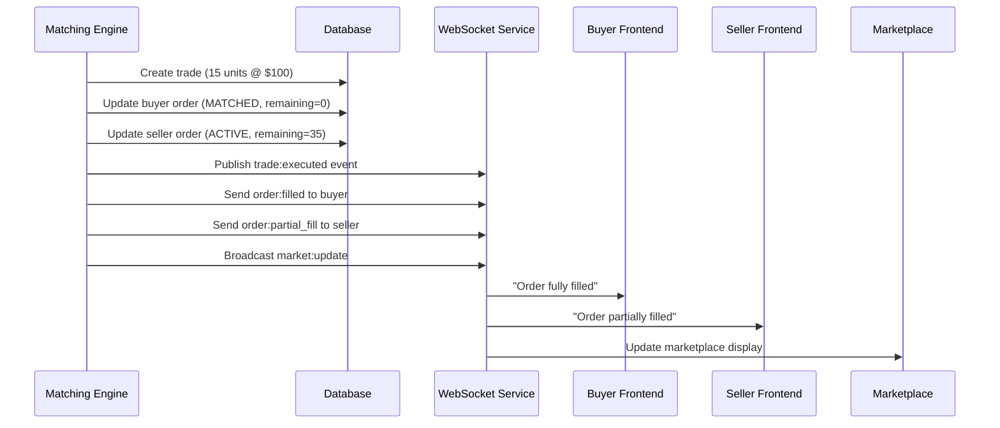

# Partial Fill System: Seller Quantity > Buyer Quantity

## Overview

The enhanced matching system now properly handles the scenario where a seller's offer quantity is greater than a buyer's bid quantity. In this case:

- ✅ **Trade executes** for the buyer's full quantity
- ✅ **Buyer order** gets status 'MATCHED' (fully filled)
- ✅ **Seller offer** remains 'ACTIVE' with reduced quantity
- ✅ **Seller offer** stays visible in marketplace with updated quantity
- ✅ **Next best orders** are properly displayed

## System Flow

### 1. Order Matching
```
Seller Offer: 50 units @ $100.00
Buyer Bid:    15 units @ $100.00
```

### 2. Trade Execution
```
Trade Amount: min(50, 15) = 15 units
Trade Price:  $100.00
```

### 3. Order Updates
```
Buyer Bid:    15 - 15 = 0 remaining  → STATUS: 'MATCHED'
Seller Offer: 50 - 15 = 35 remaining → STATUS: 'ACTIVE'
```

### 4. Database Records
- **Trade Record**: Created with 15 units @ $100.00
- **Buyer Order**: Updated to MATCHED, remaining = 0
- **Seller Order**: Updated to ACTIVE, remaining = 35

### 5. Real-time Notifications
- **Buyer**: "Your buy order was fully filled. Purchased 15 units at $100.00"
- **Seller**: "Your sell order was partially filled. 15 units sold at $100.00, 35 units remaining"

### 6. Market Display Updates
- **Marketplace**: Shows seller's offer with 35 units remaining
- **Trade List**: Shows new trade: 15 units @ $100.00
- **Order Book**: Updated to reflect new quantities

## Event Flow



## Technical Implementation

### Match Type Detection
```typescript
const bidQuantity = Number(bid.remaining);
const offerQuantity = Number(offer.remaining);
let matchType: 'FULL_MATCH' | 'PARTIAL_FILL_BUYER' | 'PARTIAL_FILL_SELLER';

if (bidQuantity === offerQuantity) {
  matchType = 'FULL_MATCH';
} else if (bidQuantity < offerQuantity) {
  matchType = 'PARTIAL_FILL_BUYER'; // Seller quantity > Buyer quantity
} else {
  matchType = 'PARTIAL_FILL_SELLER'; // Buyer quantity > Seller quantity
}
```

### Trade Amount Calculation
```typescript
const tradeAmount = Math.min(Number(bid.remaining), Number(offer.remaining));
```

### Order Status Updates
```typescript
// Buyer order (fully filled)
status: bidRemaining === 0 ? 'MATCHED' : 'ACTIVE'
remaining: bidRemaining

// Seller order (partially filled)
status: offerRemaining === 0 ? 'MATCHED' : 'ACTIVE'
remaining: offerRemaining
```

## Frontend Notifications

### WebSocket Events
- `order:filled` - Sent to buyer when fully filled
- `order:partial_fill` - Sent to seller when partially filled
- `trade:executed` - Broadcast to all relevant users
- `market:update` - Updates marketplace display

### Toast Notifications
- **Buyer**: "Order filled: 15 Silver @ $100.00"
- **Seller**: "Partial fill: 15/50 Silver @ $100.00. 35 remaining."

## Testing

Run the specific test for this scenario:
```bash
cd Backend
npm run build
node test-seller-greater-quantity.js
```

## Benefits

1. **Efficient Market**: Allows large sellers to serve multiple smaller buyers
2. **Continuous Liquidity**: Seller offers remain visible until fully consumed
3. **Real-time Updates**: All users see accurate marketplace state
4. **Clear Notifications**: Users understand exactly what happened with their orders
5. **Proper Order Flow**: Next best orders are displayed correctly

## Use Cases

- **Institutional Sellers**: Large inventories can serve multiple retail buyers
- **Market Making**: Liquidity providers can fulfill multiple orders
- **Gradual Liquidation**: Large positions can be sold in chunks
- **Price Discovery**: Market maintains accurate pricing with partial fills 